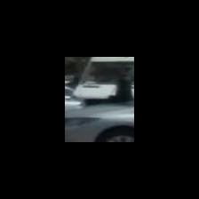

# Using Pytorch CNNs to Detect Pedestrians in Autonomous Vehicle Data
This repository focuses on data originally shared from the 2019 Kaggle Competition hosted by Lyft "3D Object Detection for Autonomous Vehicles" which can be found at https://www.kaggle.com/competitions/3d-object-detection-for-autonomous-vehicles/overview. This project showcases a Pytorch implementation of Image Classification and Object Detection.



## The Goal:

The goal of this repository is related but different to the goal set by the original Kaggle Competition. This involved heavy use of lidar data in conjuction with imagery data. This project, instead, soley focuses on using the image data for imagery based work.

In particular, the goal of this repository is to take the few hundred thousand images provided by Lyft and use them as an introductory to applications of CNN models for Image Classification and Object Detection. I thought it would be interesting and realistic to use the image data from Lyft as it was collected in a real world scenario which means it comes with the nuances and challenges that a Data Scientist would face in real world applications. Specifically, I decided that I would take the initial approach of binary classification to make the project scope more manageable, and this resulted in a focus on identifying the Pedestrian category/class. 

While this goes beyond some of the most basic Image Classification exercises one might find with common datasets like MNIST or CIFAR, it is still designed as an entry point to using CNNs on image data as well as common image preprocessing techniques. In it's initial phase (Dec 2023), the project will focus more on the application, data manipulation and model inference results rather than focusing on theory or experimenting with and across CNN architectures.

#### The initial phase yielded many interesting patterns and required domain specific knowledge in order to transform the raw dataset into something meaningful. A few of these were captured in visualizations below:
- The pie chart on the left shows one of the top performing Resnet50 model's most common error based on object category
- The upper right image (credit to University College London https://github.com/UCL/MPHY0026/blob/master/doc/calibration/camera_calibration.rst) depicts some of the complex matrix transformations that are required to translate between World Space (default) and Image Space
- The lower right image shows the full image space of a given image in our dataset denoted by the x and y axis. The red shading in the middle is a heatmap of occurences of our positive category (Pedestrian) which highlights the most common locations in the imagery that this category occurs.


## Project main Features:
### lyft_preprocessing.ipynb
### lyft_training_inference.ipynb
### create_dir_tree.py

The project is currently centered around two Jupyter Notebooks: lyft_preprocessing and lyft_training_inference. As their name suggests, the former is devoted to the many, tedious image preprocessing steps required to get images ready for model ingestion. The latter walks the user through using a plug and play Pytorch CNN model to perform Image Classification and Object Detection.

Each Notebook has many, detailed markdown cells within it that will help guide the user through the process. Additionally, each custom function has been well documented. I chose to leave all function definitions defined within the Notebook. In future phases, I will pull these out into utils.py files to clear Notebook clutter.

NOTE: The data itself does not come with the repository. The full dataset (both images and lidar) is very large. I have left more details about data access in the Data section.

NOTE: You will need to use `create_dir_tree.py` to mimic a particular file structure in combination with a set user directory path that the Notebooks expect. More in the How to Use the Project section.

# 0. Credits | Contact Information | Data Access
### Author: 
Chris Sternberger (sternbec@umich.edu | sternberger.chris@gmail.com)
### Data source
This project uses data sourced from Lyft, which is publicly available via their 2019 Kaggle Competition at https://www.kaggle.com/competitions/3d-object-detection-for-autonomous-vehicles/data
### Usage Rights & Restrictions
This project and associated data is available under MIT License.

# 1. The Data
As indicated earlier, the only data we are using for our analysis is the 2D imagery provided by Lyft in their training data and are ignoring lidar in this iteration. These RGB images are one of three sizes `[(3, 2048, 864), (3, 1224, 1024), (3, 1920, 1080)]` taken from one of seven cameras that are mounted on their fleet of Autonomous Vehicles. All images were recorded in Palo Alto from the months of January to August. Additionally, they have organized all of their data and metadata into many interlocking JSON tables. Each table comes with identifying `tokens` that can be used to join with other files/tables. The image (and lidar) files all correspond to a `sample in sample_data.json`, and the `sample_token` from `sample_data.json` is the primary identifier used for the train and test samples. Here is a quick breakdown given by Kaggle User SHREE911 (https://www.kaggle.com/code/shree911/lidar-object-det-lyft):

    - Scene(180) - 25-45 seconds snippet of a car's journey.
    - sample(22,680) - An annotated snapshot of a scene at a particular timestamp.
    - sample_data(189,504) - Data collected from a particular sensor.
    - sample_annotation(638,179) - An annotated instance of an object 
    - Instance (18,241) - Enumeration of all object instances we observed.
    - category(9) - Taxonomy of object categories (e.g. vehicle, pedestrian).
    - Attribute (18) - Property of an instance that can change while category remains the same.
    - Visibility (4) - (currently not used)
    - sensor(10) - A specific sensor type.
    - calibrated sensor(148) - Definition of a particular sensor as calibrated on a particular vehicle.
    - ego_pose(177,789) - Ego vehicle poses at a particular timestamp.
    - log(180) - Log information from which the data was extracted.
    - map(1) - Map data that is stored as binary semantic masks from a top-down view.

## Accessing the Data
All 125.79 GB of data can be accessed on via the Data tab on the Kaggle page: https://www.kaggle.com/competitions/3d-object-detection-for-autonomous-vehicles/data
For our purposes, we can ignore the lidar directories as well as sample_submission.csv and train.csv (although, feel free to "Download All" if you'd like to explore the whole suite of data).


# 2. Getting Started with the Project
## 2a. Clone the Repository to your local or hosted machine
```
git clone https://github.com/Stern04/MADS_Capstone.git
```
## 2b. Create virtual environment
```
git clone https://github.com/Stern04/MADS_Capstone.git
```
## 2c. Getting set up
Once you have the repository cloned, you will need to create a virtual environment and install the required libraries. Of all the libraries installed, the most notable are `torchvision==0.17.0.dev20231018+cu118` and `lyft-dataset-sdk @ git+https://github.com/lyft/nuscenes-devkit@49c36da0a85da6bc9e8f2a39d5d967311cd75069`
```
pip install -r requirements.txt
```
Then, you need to run the create_dir_tree.py script. This will mimic the directory structure that the Notebooks expect. The user can alter this, but it makes the Notebooks easier to use out of the box.
Ensure that you are in the main directory.
```
cd S:\MADS\Capstone\3d-object-detection-for-autonomous-vehicles>
python3 create_dir_tree.py
```
Lastly, since we don't yet have a pipeline to transfer the data from the Lyft data download, the user will have to copy paste 


